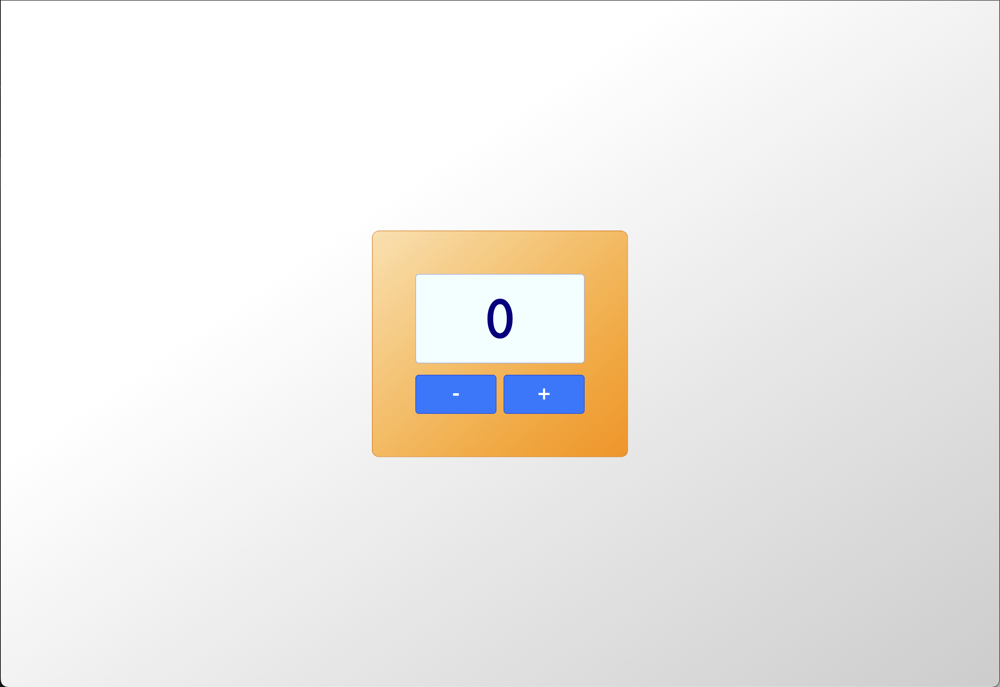

# Counter App

A simple interactive Counter App built using HTML, CSS, and JavaScript. This app allows users to increment and decrement a counter with just a click of a button.



## Table of Contents

- [Built With](#built-with)
- [Getting Started](#getting-started)
  - [Prerequisites](#prerequisites)
  - [Installation](#installation)
- [Usage](#usage)
- [Roadmap](#roadmap)
- [Contributing](#contributing)
- [License](#license)
- [Contact](#contact)

## Built With

- HTML
- CSS
- JavaScript

## Getting Started

To get a local copy of the Counter App up and running on your machine, follow these simple steps:

### Prerequisites

You need to have a modern web browser installed, such as Chrome, Firefox, or Safari.

### Installation

1. Clone the repo
   ```sh
   git clone https://github.com/emmekkappa/CounterApp.git
   ```

2. Open the `index.html` file in your preferred web browser.

## Usage

Once the app is open in your browser, you can interact with it by clicking the "+" and "-" buttons to increment and decrement the counter value. The current counter value is displayed at the center of the app.

## Roadmap

Here are some potential future enhancements for the Counter App:

- Implement animations for a more engaging user experience.
- Add a reset button to set the counter value back to zero.
- Allow users to customize the initial counter value.
- Enable users to change the increment and decrement step size.

## Contributing

Contributions are welcome! If you have ideas for improvements or new features, please feel free to fork the project and submit a pull request.

1. Fork the Project
2. Create your Feature Branch (`git checkout -b feature/AmazingFeature`)
3. Commit your Changes (`git commit -m 'Add some AmazingFeature'`)
4. Push to the Branch (`git push origin feature/AmazingFeature`)
5. Open a Pull Request

## License

Distributed under the MIT License.

## Contact

Mikael Festa - mikaelstadia@gmail.com

Project Link: [https://github.com/emmekkappa/CounterApp](https://github.com/emmekkappa/CounterApp)